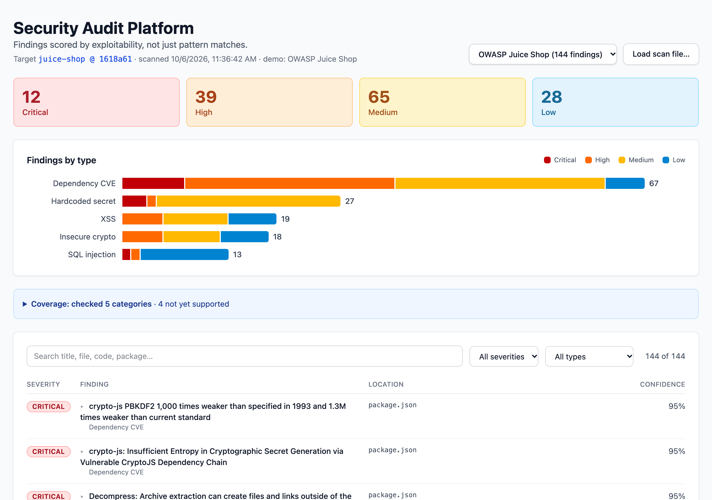
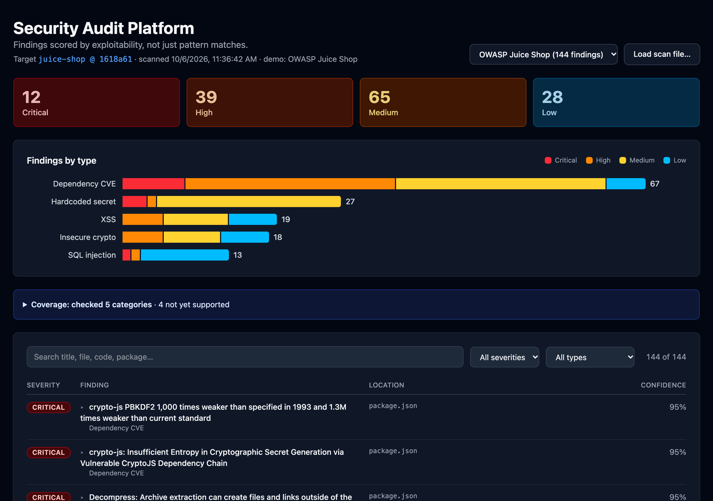
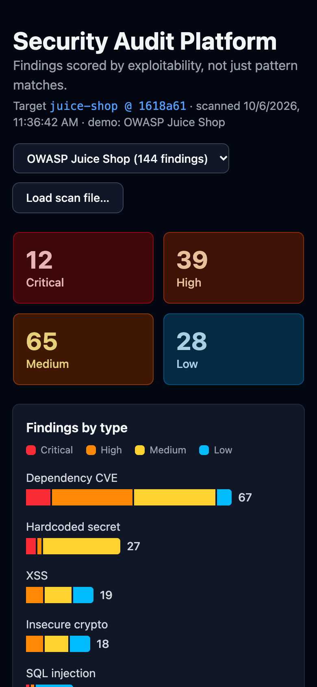
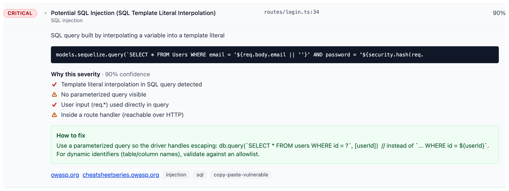

# Security Audit Platform

Real vulnerability scanner + interactive dashboard for portfolio. It scores findings by exploitability, not just pattern matches.

**Live demo:** https://dash-jade-nine.vercel.app/



<table>
  <tr>
    <td width="72%"></td>
    <td></td>
  </tr>
  <tr>
    <td align="center">Dark mode (follows the system setting)</td>
    <td align="center">Phone, 390px</td>
  </tr>
</table>

## Features

- **Dependency Scanning**: Parse `package.json` → npm audit advisories with the patched version (Node.js only for now)
- **Pattern Detection**: hardcoded secrets, SQL injection, XSS, insecure crypto (weak hashes, hardcoded keys, broken ciphers, `Math.random()` for secrets, JWT algorithm confusion, Hashids salts). Async footguns are planned.
- **Contextual Scoring**: Not just "vuln found" → "exploitable if X AND Y AND Z". Each finding lists the ✓ / ⚠ / ? factors that moved its severity (user input on the line, route handler, escaping nearby, test or training code).
- **Coverage Report**: Shows what was checked *and* what isn't supported yet, so 0 findings means "clean", not "never looked"
- **Interactive Dashboard**: Severity cards, a findings-by-type chart, search, severity and type filters, expandable rows explaining each score. Dark mode follows the system setting, and the layout works on phones.
- **Remediation Guidance**: Fix steps with before/after code, plus OWASP / GitHub advisory links

Validated against intentionally vulnerable apps with known answers: SQL injection 3/3, XSS 8/9 OWASP Juice Shop challenges + 3/3 DVNA.

## How It Works

```
Scanner (Node.js) → JSON Output → React Dashboard
```

1. **Scan.** `npm run scan <repo>` walks the target's source files and runs four checks:
   - **Dependency CVEs:** `npm audit` on the target's lockfile. Without a lockfile, the tree is resolved into a temporary one first; the target isn't modified. A second production-only audit tells runtime dependencies from dev-only ones.
   - **Hardcoded secrets:** provider key formats (AWS, private keys, GitHub/GitLab tokens, Slack/Discord webhooks) and literal values assigned to password, token, API-key, and secret keys, including unquoted `KEY=value` lines in `.env` files. Templated values (`${…}`, `{{ }}`) are skipped.
   - **SQL injection and XSS:** regexes find risky constructs, such as SQL built with `+` or `${}`, `innerHTML`, `bypassSecurityTrust*`, and unescaped template output. Multi-line statements are joined first, so a query split across lines still matches.
2. **Score.** For SQL injection and XSS, a match starts at **medium** and moves up or down based on what's in the 15 lines around it:
   - **Up:** request data (`req.body`, `req.query`, …) on the same line or nearby, URL or storage values read in browser code (XSS), or code inside a route handler, which makes it reachable over HTTP.
   - **Down:** escaping, a sanitizer, or a numeric cast nearby, or a value that looks like a constant.
   - **Capped at low:** test, example, and training-snippet files.

   Other findings are scored too:
   - **Dependencies:** the advisory's severity, capped at low for dev-only packages. Factors give the installed version, the direct dependency that pulls it in, and the fix npm suggests, which can be a downgrade.
   - **Secrets:** provider-format keys keep their severity anywhere, because a real key is leaked wherever it sits. Generic passwords and tokens drop to **low** when the value looks like a placeholder or the file is a test, example, or training snippet, and to **medium** in seed data.

   Every adjustment is recorded as a ✓ / ⚠ / ? factor, so the dashboard can show *why*.
3. **Report.** Findings, factors, remediation, and a coverage list (what was checked, what isn't supported yet, and any errors) go to `scanner-output.json`.
4. **Explore.** The React dashboard loads that file, or a committed demo scan, and lets you filter, search, and expand each finding.

Example: Juice Shop's login query (`routes/login.ts:34`) is **critical**. It interpolates `req.body.email` straight into SQL inside a route handler, and the dashboard lists each of those reasons:



The same construct in Juice Shop's `data/static/codefixes/` training snippets never runs, so those findings are capped at **low**. That's 11 of Juice Shop's 13 SQL injection findings.

## Results on the Demo Targets

The live demo shows these scans. Each one is committed under `public/demo/` with secrets redacted and pinned to the commit shown.

| Target | Dependency CVEs | Secrets | SQL injection | XSS | Insecure crypto | Total |
|---|---|---|---|---|---|---|
| [OWASP Juice Shop](https://github.com/juice-shop/juice-shop) @ `1618a61` | 67 (8 critical, 27 high; 3 dev-only → low) | 27 (3 private keys, 1 hardcoded test password, 23 seed-data passwords → medium) | 13 (1 critical, 1 high, 11 low snippets) | 19 (5 high, 8 medium, 6 low snippets) | 18 (5 high, 7 medium, 6 low) | 144 |
| [DVNA](https://github.com/appsecco/dvna) @ `9ba473a` | 58 (15 critical, 19 high; all runtime) | 1 (session secret, high) | 1 (critical) | 10 (medium) | 2 (high: MD5 reset token) | 72 |
| [Express](https://github.com/expressjs/express) @ `7ef9844` | 5 (all dev-only → low) | 6 (all in `examples/`, low) | 0 (it has no SQL) | 54 (all low: `test/`, `examples/`) | 0 (no crypto sinks) | 65 |

**Recall against known answers.** Juice Shop and DVNA document their intended vulnerabilities, which gives an answer key:
- **SQL injection:** 3/3 found (`juice-shop/routes/login.ts:34`, `juice-shop/routes/search.ts:23`, `dvna/core/appHandler.js:10`). Juice Shop's static query and its "correct fix" files are not flagged.
- **XSS:** 8 of 9 Juice Shop challenges and 3/3 DVNA. The miss is Juice Shop's CSP Bypass: user input is spliced into a Pug template string that is then compiled. That's template injection, which the scanner doesn't detect yet.
- **Insecure crypto:** 5 of 6 code-level Juice Shop crypto challenges (Password Strength, Weird Crypto, Imaginary Challenge, Unsigned JWT, Forged Signed JWT) and 1/1 DVNA (reset token = `md5(login)`, both sites). The miss is Forged Coupon (z85 encoding used as if it were crypto), left out on purpose: an encoder call alone doesn't say it protects anything. Juice Shop's MD5 lives in a generic `hash()` helper; the scanner traces its callers and reports it **high** because 6 of them hash passwords. Express has no crypto sinks and gets 0 findings.

**Known limitations** (tracked in [HANDOFF.md → Open TODOs](HANDOFF.md#open-todos)):
- **Versions are resolved at scan time without a lockfile.** None of the three targets commits one, so npm resolves what it would install today, and counts can change between scans. Each finding says so.
- **Regex, not data flow.** `search.ts:23` stays **high** rather than critical because `req.query.q` reaches the query through a variable.

## Getting Started

```bash
npm ci
npm run scan <target-repo-path>  # writes scanner-output.json to the current directory
npm run dev                       # dashboard at http://localhost:5173 (loads scanner-output.json)
npm test                          # scanner + dashboard helper tests
npm run lint                      # ESLint (CI runs it)
npm run demo:export               # regenerate public/demo/ (needs the three targets cloned under /tmp)
npm run screenshots               # regenerate docs/screenshots/ from the live site (needs Chrome)
npm run build                     # production build
```

Try it on a known-vulnerable app: `git clone --depth 1 https://github.com/juice-shop/juice-shop.git /tmp/juice-shop && npm run scan /tmp/juice-shop`.

Without a local `scanner-output.json`, the dashboard opens the Juice Shop demo. Use the "Demo scan" picker to switch to DVNA or Express, or "Load scan file…" to open any report.

## Talking Points

- **The problem:** pattern scanners flag every match, so real issues drown in noise. This one scores exploitability and shows its reasoning: the login SQL injection above is critical for stated reasons, and the identical code in a training snippet is low.
- **Measured, not claimed:** checked against two intentionally vulnerable apps with documented answers. SQL injection 3/3; XSS 8/9 Juice Shop challenges + 3/3 DVNA; insecure crypto 5/6 Juice Shop challenges + 1/1 DVNA. The misses are known gaps (template injection, z85 coupons).
- **Honest coverage:** the report lists the 4 categories it doesn't check yet, so "0 findings" can't be mistaken for "secure".
- **A silent failure I found in my own scanner:** `npm audit` needs a lockfile. On DVNA it failed, and the failure was read as "no vulnerabilities", so the demo showed 0 dependency CVEs. There are 58, 15 of them critical. Errors now surface in the report, and targets without a lockfile are resolved in a temp directory.
- **Noise is a bug too:** Juice Shop's secret findings went from 41 (38 high) to 27. Fourteen were templated values like `${var.project_name}`, and the 23 seed-data passwords are now medium. The same pass closed blind spots that tests now cover: PKCS#8 private keys, GitLab tokens (the pattern had the wrong prefix), passwords in JSON, and session secrets (DVNA's).
- **Trade-offs:**
  - **Regex + local context instead of an AST or taint analysis:** fast and explainable, but it misses data flow through variables (`search.ts:23`).
  - **Node.js only.**
  - **Recall over precision for now:** the secret noise is visible, not hidden.
- **Engineering:**
  - **Tests:** 129 across 9 suites (scanners, file walker, npm audit parsing, demo export, dashboard logic).
  - **Protected `main`:** CI must pass (`npm ci` → `npm test` → `npm run lint` → `npm run build`) before anything merges.
  - **Fail-closed demo export:** it refuses to write a file that still contains a key format.
  - **Repo hygiene:** secret scanning and push protection are on.
  - **Accessibility:** contrast measured in light and dark mode, and chart colors checked for color-vision deficiency.
- **Next:** the async-footgun scanner, then template injection.

## Project Structure

```
src/
├── scanner/       # CLI, dependency + pattern scanners, shared file helpers, tests
├── components/    # Dashboard components (cards, chart, coverage, filters, table)
├── pages/         # Dashboard page
└── utils/         # Pure dashboard logic (filter/sort/count/chart rows), unit-tested
scripts/           # Demo-data export, README screenshots
public/demo/       # Committed, redacted demo scans served by the deployed dashboard
```

## Milestones

- [x] Week 1: Dependency scanner (npm audit integration)
- [x] Week 1: Pattern scanner (hardcoded secrets, SQL injection, XSS)
- [x] Deferred: Insecure crypto scanner
- [ ] Deferred: Async footguns scanner
- [x] Week 2: React dashboard with table, search, filtering, coverage report
- [x] Week 2: Severity visualization, dark mode, phone layout
- [x] Week 3: Demo data for three scans with a picker
- [x] Week 3: Deploy (Vercel): https://dash-jade-nine.vercel.app/
- [x] Week 3: README screenshots, how it works, talking points
- [ ] Later: PDF export, false-positive tuning

Status and docs: [STATUS.md](STATUS.md) · [PRD.md](PRD.md) · [DESIGN.md](DESIGN.md) · [CONTRIBUTING.md](CONTRIBUTING.md)
